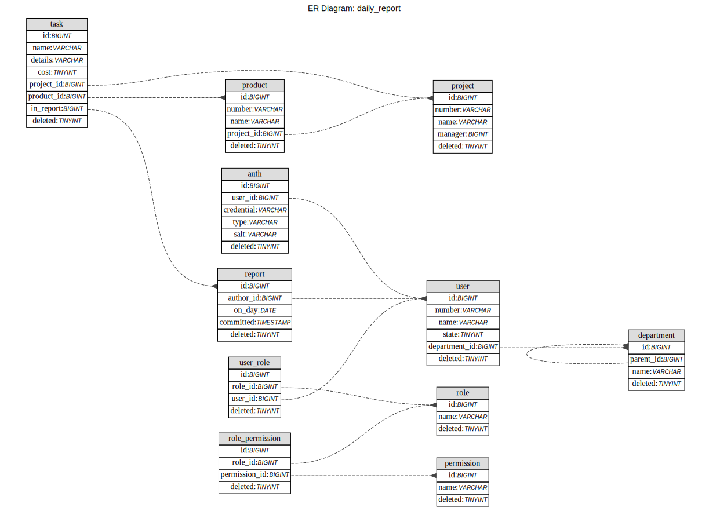

# 工作日志系统开发文档

[toc]

## 概述

公司目前的工作日志使用的是邮件收发, 存在使用不便、统计不便以及格式混乱等问题,急需一套替代的系统,能够很好的解决相关的问题, 方便员工提交工作日志,并且提高项目工时和员工考勤的统计效率.

基于上面的目标,使用此系统的人员分为员工、部门经理、项目经理和PMO成员, 其中员工可以编辑和提交工作日志功能,部门经理则可以查看本部门的员工提交的日志, 项目经理可以查看和统计项目成员的日志和工时.PMO成员可以查看所有员工的工作日志,并可以进行所需的统计.

## 功能结构

### 功能设计

根据需求, 此系统所需的基本功能包括以下内容:

1. 工作日志的编辑、保存和提交
2. 工作日志的查询, 可以按日期、员工编号等
3. 工时统计, 可以按员工编号、项目/产品编号等
4. 自动提醒未在当天提交工作日志的员工
5. ...

除此之外, 需要引入其他功能以提供和操作数据:

1. 用户登录、登出
2. 用户角色和权限
3. 查询结果的排序和过滤
4. 录入组织人员信息,可以批量导入,并且允许新增、修改和删除
5. 录入项目和产品信息
6. ...

### 技术方案

系统采用B/S架构, 并应该支持在移动端登录和提交日志,相关页面应进行适配.

后端采用的框架为Spring, 数据库使用mysql, 缓存采用redis.

核心依赖包括:

1. Spring boot
2. shiro
3. mybatis plus
4. mapstruct
5. ...

前端采用的框架为vue2.x, 路由采用vue-router, 组件库为ant-design-vue.

核心依赖包括:

1. axios
2. vuex
3. mockjs
4. moment
5. ...

## 核心流程

暂无

## 页面结构

### 产品原型定义

暂无

### 页面结构图

暂无

## 数据结构

数据库ER图

## 接口方案

### 服务端接口

服务端接口采用接近于RESFUL风格的设计,以使URL尽可能清晰简短,扩展性强.

目前已有的接口如下表所示,后续随着开发进度,会继续添加和变更.

| url\method                                         | get                | post     | put                | delete           |
| :------------------------------------------------- | ------------------ | -------- | ------------------ | ---------------- |
| /v1/daily_report/user                              | 获取用户信息       | 新建用户 | 修改信息           | 删除用户         |
| /v1/daily_report/user/login                        | ✕                  | 用户登录 | ✕                  | ✕                |
| /v1/daily_report/user/logout                       | ✕                  | 用户登出 | ✕                  | ✕                |
| /v1/daily_report/user/password                     | 查看密码           | 重置密码 | 修改密码           | ✕                |
| /v1/daily_report/report                            | 获取个人工作日志   | 提交日志 | 修改日志内容或状态 | 删除未提交的日志 |
| /v1/daily_report/report/dm                         | 获取部门成员日志   | ✕        | ✕                  | ✕                |
| /v1/daily_report/report/pm                         | 获取项目成员日志   | ✕        | ✕                  | ✕                |
| /v1/daily_report/report/pmo?type=xxx&condition=xxx | 获取满足条件的日志 | ✕        | ✕                  | ✕                |
| ...                                                |                    |          |                    |                  |

### 用户角色权限设计

| 权限\角色                   | staff | pm         | dm         | pmo  | admin |
| --------------------------- | ----- | ---------- | ---------- | ---- | ----- |
| 编辑/保存/删除/提交个人日志 | ✓     | ✓          | ✓          | ✓    | ✓     |
| 编辑/删除他人日志           | ✕     | ✕          | ✕          | ✕    | ✓     |
| 查看他人日志                | ✕     | 仅项目成员 | 仅部门成员 | ✓    | ✓     |
| 统计工时                    | ✕     | 仅项目成员 | 仅部门成员 | ✓    | ✓     |
| 导入/更改组织人员信息       | ✕     | ✕          | ✕          | ✕    | ✓     |
| 新增/编辑/删除项目信息      | ✕     | ✓          | ✕          | ✓    | ✓     |
| 修改个人密码                | ✓     | ✓          | ✓          | ✓    | ✓     |
| 重置他人密码                | ✕     | ✕          | ✕          | ✕    | ✓     |
| ...                         |       |            |            |      |       |

### 用户持久化

后端持久化采用mysql关系数据库+redis缓存相结合的方式; 

其中redis用于实现基于token的单点登录认证.

前端使用HTML5引入的localStorage存储用户token,实现一段时间内无需密码登录的要求.

## 开发约定

### 开发平台和语言

后端使用IDEA社区版 java1.8,前端使用Visual Studio Code+vetur插件, Javascript ES2015 

### 技术要点说明

### 遗留问题讨论